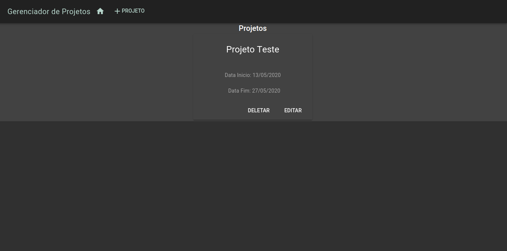
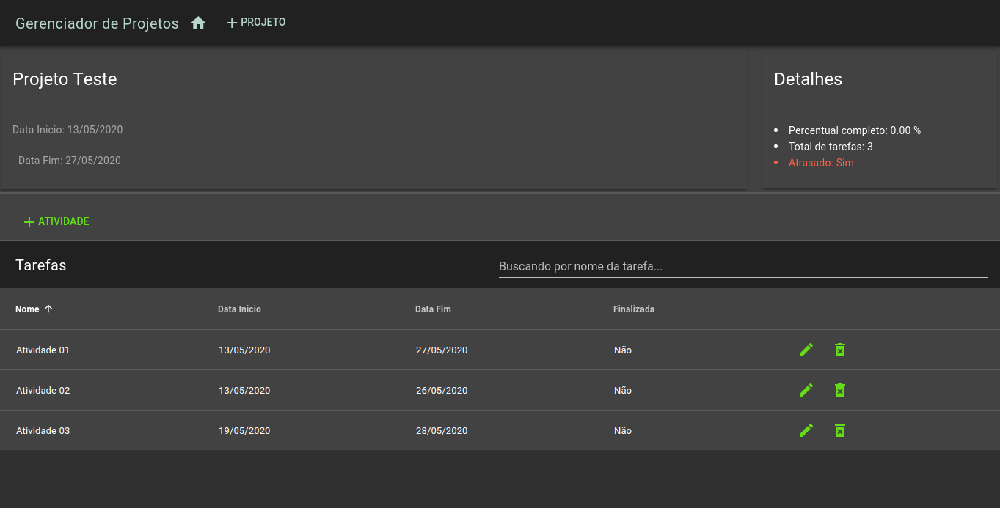

# FCOProjectMananger

## Tecnologias Utilizadas
  - Spring Boot
  - JPA
  - Hibernate
  - Java 8
  - H2
  - VueJS
  - Docker
  
### Como executar o projeto?
Para executar o projeto, voce deve clonar o mesmo e executar o docker-compose.yml que existe no projeto. Para isso vc deverá ter previamente instalado o docker e docker-compose em sua maquina. O comando abaixo ira fazer o download das imagens de backend e frontend, que estao no dockerhub:

```sh
$ docker-compose up
```

> Obs: O banco de dados, foi utilizado o H2 somente para testes, sendo assim se aplicação foi derrubada os dados não irão persistir

### Endereço de acesso:
A aplicação pode ser acessada via browser nos seguintes endereços:

<http://127.0.0.1:8081/#/>

ou mesmo

http://localhost:8081/#/

### Funcionalidades da aplicação

Essa aplicação tem por objetivo controlar projetos e suas atividades. Nela o usuario pode ver algum dados que pode ajudar em  tomadas de decisão, como por exemplo consultar se alguma tarefa irá ultrapassar a data limite de projeto.


A imagem que esta logo abaixo, é o Home da aplicação, nela o usuario irá poder criar, consultar editar e excluir projetos:
<br />
<br />



<br />
<br />

Nessa tela, o usuário poderá inserir as tarefas em um projeto e tem o controle das informações do projeto, como quantidade de tarefas total do projeto, percentual completo e até mesmo se o projeto irá atrasar.

<br />
<br />





